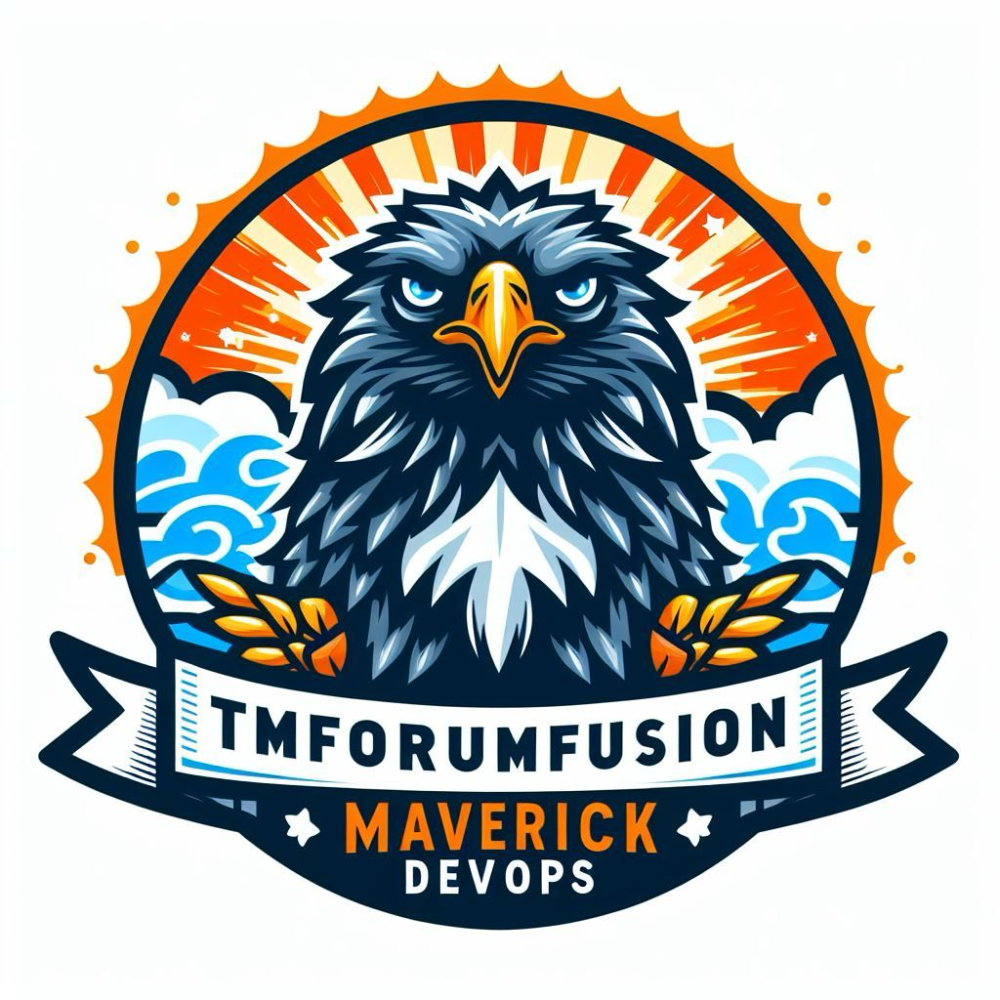

    

TMForumFusion Maverick is a state-of-the-art TMForum mocker designed to elevate your testing and development experience. With seamless simulation of interactions, this tool enhances efficiency and precision in your projects.

## Features:

- **TMForum Simulation:** Mimic TMForum interactions effortlessly for robust testing.
- **Enhanced Testing:** Elevate your testing process with accurate and dynamic simulations.
- **Development Efficiency:** Streamline development by replicating TMForum behaviors with precision.
- **Seamless Integration:** Easily integrate ForumFusion Maverick into your existing workflow for a smooth experience.

## Getting Started:

1. **Installation/Usage:**
  - Execute the  with:

      -  - 

      -  &  -  

  - Include the updated or add new  structure in the **"custom/tmf"** folder section here.

  - Connect your CTK to TMForumFusion-Maverick:
      - http://localhost:9000/{json-structure}
        - example : http:localhost:9000/ping
      - https://localhost:8000/{json-structure}
        - example : https:localhost:8000/ping

2. **Feedback:**
   - Your feedback is important to me! Please express your thoughts and suggestions to contribute to our ongoing improvement efforts.

## License:

TMForumFusion Maverick is licensed under MIT. See the  for details.

# Support
This is a community-developed project. There is no official tmforum support for this project.